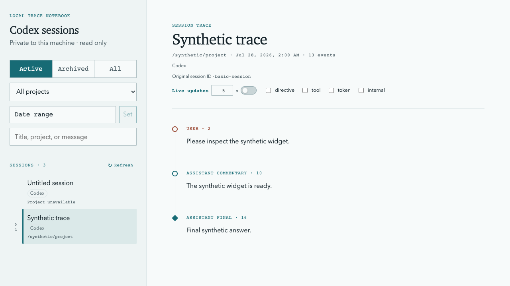

# Codex Sessions Reader

A private, read-only web viewer for local Codex session history.

It reads rollout JSONL files from your Codex home and serves a responsive local
interface. It does not edit, delete, resume, export, or upload sessions, and it
does not create a persistent index or cache.



## Quick start

Requirements:

- Node.js 22.13 or newer
- npm
- A local Codex home (usually `~/.codex`)

Install, build, and start:

```sh
npm install
npm run build
npm start
```

Open `http://127.0.0.1:4173`. The server prints the exact URL at startup and
detects session changes without a restart. Press `Ctrl-C` to stop it.

## Configuration

Set these environment variables before starting the server:

| Variable | Default | Description |
| --- | --- | --- |
| `CODEX_HOME` | `~/.codex` | Codex home containing `sessions/` and optionally `archived_sessions/` |
| `CODEX_VIEWER_HOST` | `127.0.0.1` | Server host |
| `CODEX_VIEWER_PORT` | `4173` | Server port; use `0` to select a free port automatically |

Example:

```sh
CODEX_HOME=/path/to/codex-home CODEX_VIEWER_PORT=4180 npm start
```

Restart the server after changing configuration.

## Features and limits

- Browse active and archived Codex sessions.
- Search session titles, project paths, and visible user and assistant messages.
- Render Markdown, GitHub-flavored Markdown, and KaTeX math.
- Continue reading rollout files while Codex is writing them.
- Handle malformed or unknown records with diagnostics where possible.

The viewer reads only `rollout-*.jsonl` files. It does not inspect Codex
databases. Large records and responses are capped to keep memory and search work
bounded. See [Session JSONL filtering rules](docs/session-jsonl-filtering.md)
for the detailed decoding and visibility policy.

## Security

The server listens on loopback by default and exposes a read-only API. It
rejects path traversal and symlink escapes, does not enable permissive CORS, and
does not expose raw filesystem paths or Codex records.

Rendered Markdown cannot run raw HTML. Remote images are replaced with text,
and unsafe links are disabled.

Loopback protects against network access, not other processes or users on the
same machine. If you bind to a non-loopback address or place the viewer behind a
reverse proxy, add authentication and restrict network access.

## Architecture decisions

Accepted architecture decisions are recorded under [`docs/adr`](docs/adr):

- [ADR-0001: Generation-based whole-file session snapshots](docs/adr/0001-use-generation-based-session-snapshots.md)
- [ADR-0002: JSONL-only session discovery](docs/adr/0002-use-jsonl-only-session-discovery.md)
- [ADR-0003: Session source adapters](docs/adr/0003-use-session-source-adapters.md)
- [ADR-0004: Session-scoped reader revisions](docs/adr/0004-use-session-scoped-reader-revisions.md)
- [ADR-0005: Query-scoped revisions for session-list pagination](docs/adr/0005-use-query-scoped-revisions-for-session-list-pagination.md)
- [ADR-0006: Conditional read cursors for session resources](docs/adr/0006-use-timeline-prefix-continuity.md)

## Development

Run the client-only Vite server:

```sh
npm run dev
```

This does not provide the local session API. Use `npm run build` followed by
`npm start` when testing real session data.

Verification commands:

```sh
npm run typecheck
npm test
npm run build
```

An optional scale benchmark creates a temporary synthetic corpus under
`/private/tmp` and removes it afterward:

```sh
npm run benchmark:scale
```

## Troubleshooting

**No sessions appear**

Point `CODEX_HOME` to the directory containing `sessions/`, not to `sessions/`
itself. Session files must be regular files named `rollout-*.jsonl`.

**A session shows diagnostics**

Codex may still be writing the file, or a record may exceed a safety limit.
Wait for the write to finish and reload.

**Search returns partial results**

Narrow the search with a project or date filter, or use a more specific phrase.

**The port is already in use**

Choose another port:

```sh
CODEX_VIEWER_PORT=4180 npm start
```

## Uninstall

Stop the server and delete this repository. The viewer creates no database,
background service, or cache in your Codex home, so your sessions are not
affected.
